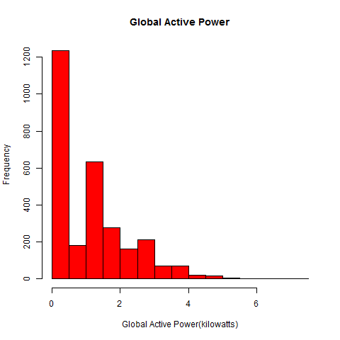
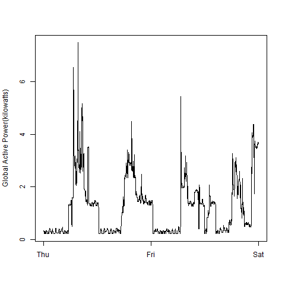
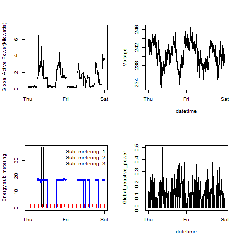

## Introduction

This is my homework for <a href="https://class.coursera.org/exdata-020">Exploratory Data Analysis</a> week 1, using dataset of <a href="https://d396qusza40orc.cloudfront.net/exdata%2Fdata%2Fhousehold_power_consumption.zip">Electric power consumption</a> [20Mb] from the <a href="http://archive.ics.uci.edu/ml/">UC Irvine Machine Learning Repository</a>.

The four plots for the assignment and the codes are in source. 

### Plot 1

 

### Plot 2

 

### Plot 3

 

### Plot 4

 

